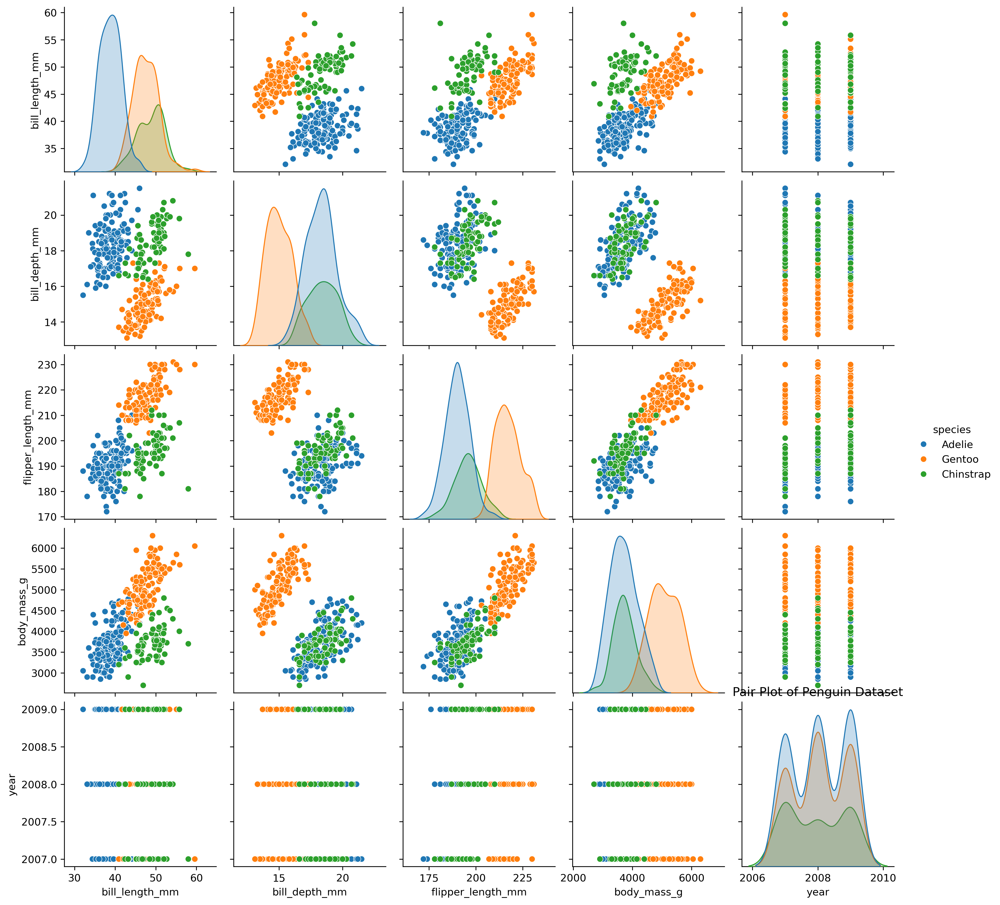
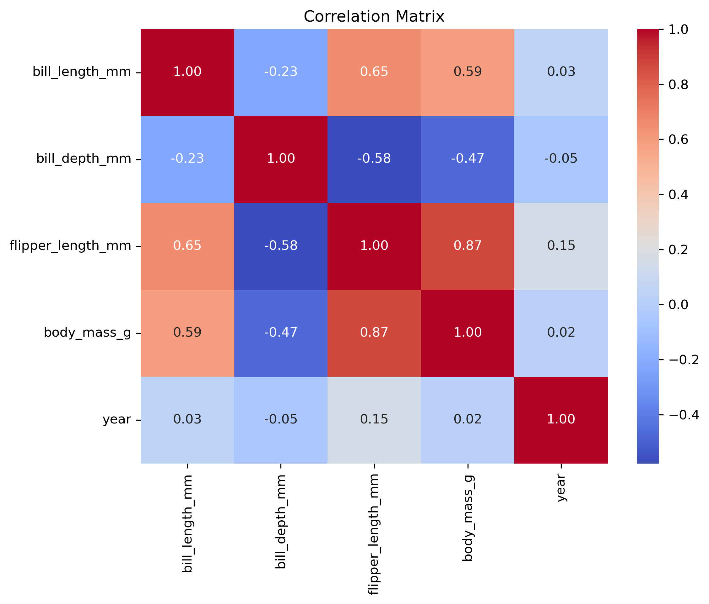

# 企鵝數據分析專案 (Penguin Data Analysis)

本專案旨在分析企鵝數據集（Palmer Penguins），探索企鵝不同物種之間的物理特徵差異，並研究各項數值參數之間的相關性。

## 專案內容

本專案包含以下檔案：

- `penguins.csv`: 原始數據集，包含企鵝的物種、島嶼、物理特徵（喙長、喙深、鰭長、體重）、性別及觀測年份。
- `penguins_analysis.py`: Python 分析腳本，負責資料清洗、視覺化圖表生成及相關性分析。
- `企鵝數據結果分析.txt`: 數據分析的文字心得與結論。
- `penguins_pairplot.png`: 企鵝各項特徵的配對圖（Pair Plot），依物種著色。
- `penguins_correlation_matrix.png`: 數值特徵的相關性矩陣熱圖（Correlation Matrix）。

## 分析重點與發現

根據 `penguins_analysis.py` 的分析結果與 `企鵝數據結果分析.txt` 的紀錄，主要的發現如下：

1. **物種區分性**：
   - 資料中的三種企鵝（Adelie, Gentoo, Chinstrap）在物理特徵上具有高度群聚性，可透過特徵有效分類。

2. **關鍵特徵關聯**：
   - **強正相關**：體重 (`body_mass_g`) 與鰭狀肢長度 (`flipper_length_mm`) 呈現極強正相關（係數 0.87）。
   - **Gentoo 的獨特性**：擁有最長的鰭、最重的體重，但喙深 (`bill_depth_mm`) 最淺。
   - **負相關趨勢**：喙深與體型相關特徵（鰭長、體重）呈現中度負相關。

3. **年份無關性**：
   - 觀測年份 (`year`) 與物理特徵之間沒有顯著的線性關係。

## 如何執行

### 1. 環境準備

確保您的環境已安裝 Python，並安裝所需的套件：

```bash
pip install pandas seaborn matplotlib
```

### 2. 執行分析

執行以下指令以生成分析圖表：

```bash
python penguins_analysis.py
```

執行後將會產生 `penguins_pairplot.png` 與 `penguins_correlation_matrix.png` 兩張圖表。

## 數據視覺化範例

### 配對圖 (Pair Plot)


### 相關性矩陣 (Correlation Matrix)

